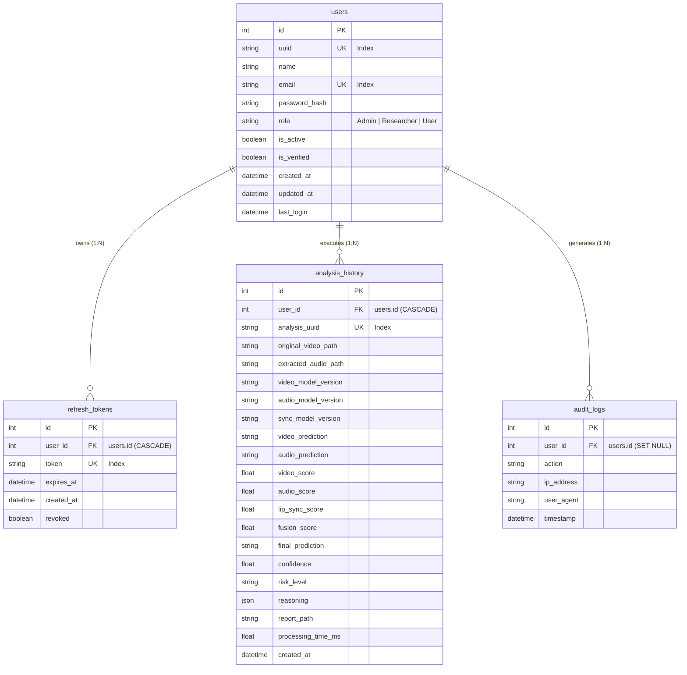

# Authentix: Multimodal Deepfake Detection & Explainability Platform

[](https://python.org)
[](https://fastapi.tiangolo.com)
[](https://pytorch.org)
[](https://react.dev)
[](https://vitejs.dev)
[](https://tailwindcss.com)

**Authentix** is an enterprise-grade, multimodal AI platform designed to detect, analyze, and explain synthetic media manipulations across video visual streams, audio speech tracks, and visual-auditory lip synchronization. By fusing deep learning models with a consensus-driven calibration engine, Authentix protects digital trust and provides human-interpretable forensic reasoning.

---

## 🚨 Problem Statement

The rapid advancement of generative AI (e.g., GANs, diffusion models, voice cloning neural networks) has made creating highly convincing fake videos accessible to anyone. Traditional single-modality deepfake detection tools suffer from major limitations:

1. **Single-Modality Blindspots**: Detectors that focus exclusively on visual artifacts fail when confronted with cloned audio paired with real footage. Conversely, audio-only detectors miss visual face-swaps.
2. **Multi-Vector Attacks**: Modern deepfakes often combine real facial videos with synthetic voiceovers or out-of-sync lip replacements (Lip-Sync attacks).
3. **False Confidence & Modal Contradictions**: Naive score averaging lowers suspicion when one modality is genuine and another is manipulated, causing dangerous false negatives.
4. **Black-Box Output**: Legacy tools produce raw probability scores without explaining *why* a file was flagged, offering no actionable insights for human auditors.

---

## 💡 Solution

Authentix addresses these challenges through a **4-Tiered Multimodal Detection Engine**:

- **Visual Frame Inspection**: MobileNetV3-Small fine-tuned for high-throughput spatial forgery detection.
- **Auditory Speech Analysis**: Pretrained transformer backbones (`Wav2Vec2` / `WavLM`) for synthetic voice and spectral artifact classification.
- **Temporal Lip-Sync Mismatch Engine**: Dual-stream pipeline integrating S3FD face tracking, MediaPipe 478 3D landmarks, and SyncNet audio-visual correlation analysis.
- **Consensus & Threat-Calibrated Fusion Engine**: A multi-modality fusion system ($W_{\text{video}}=0.50$, $W_{\text{audio}}=0.30$, $W_{\text{lipsync}}=0.20$) equipped with variance confidence penalty calibration, single-channel threat escalation, and automated natural language reasoning generation.

---

## ✨ Features

- 🎥 **Multimodal Analysis**: Simultaneously processes visual frames, extracted audio tracks, and temporal lip-to-speech synchronization.
- ⚖️ **Variance-Calibrated Fusion Engine**: Automatically penalizes confidence when modal predictions conflict and escalates risk if any single channel detects a high-risk attack ($>0.70$).
- 📝 **Automated Rule-Based Explainability**: Generates clear, plain-English diagnostic claims explaining exact evidence of tampering or authenticity.
- 📊 **Interactive Analytics Dashboard**: Modern React UI with real-time risk gauges, modal breakdowns, audio playback waveforms, frame previews, and audit logs.
- 📄 **Exportable Forensic PDF Reports**: Automated generation of official downloadable PDF analysis reports containing detailed metrics and diagnostic charts.
- 🔒 **Enterprise Backend Security**: FastAPI REST API equipped with JWT authentication, role-based access control (User/Admin), async database sessions (PostgreSQL/SQLite), and audit logging.
- ⚡ **Optimized Pipeline & Self-Testing**: Modular architecture with automated dependency resolution (FFmpeg, weights auto-download) and CLI self-testing suites.

---

## 🏗️ System Architecture & Visual System Design

### 📐 System Architecture Diagram


---

### 🤖 System Design - AI Models & Pipelines


---

### 🔄 End-to-End Data Workflow

```text
                           ┌────────────────────────┐
                           │      User Upload       │
                           │     (MP4/AVI/MOV)      │
                           └───────────┬────────────┘
                                       │
                                       ▼
                           ┌────────────────────────┐
                           │   FastAPI Web Server   │
                           └───────────┬────────────┘
                                       │
                   ┌───────────────────┼───────────────────┐
                   │                   │                   │
                   ▼                   ▼                   ▼
         ┌───────────────────┐┌───────────────────┐┌───────────────────┐
         │   Video Engine    ││   Audio Engine    ││  Lip-Sync Engine  │
         │ MobileNetV3-Small ││ Wav2Vec2 / WavLM  ││ S3FD + MediaPipe  │
         │ Spatial Forgery   ││ Synthetic Speech  ││    + SyncNet      │
         └─────────┬─────────┘└─────────┬─────────┘└─────────┬─────────┘
                   │                   │                   │
                   └───────────────────┼───────────────────┘
                                       │
                                       ▼
                           ┌────────────────────────┐
                           │  Multimodal Fusion &   │
                           │   Calibration Engine   │
                           ├────────────────────────┤
                           │ • Weighted Aggregation │
                           │ • Variance Penalty     │
                           │ • Threat Safeguard     │
                           │ • Plain-English Logic  │
                           └───────────┬────────────┘
                                       │
                   ┌───────────────────┴───────────────────┐
                   ▼                                       ▼
       ┌───────────────────────┐               ┌───────────────────────┐
       │   Database & Audit    │               │  React Dashboard &    │
       │ (SQLAlchemy / Alembic)│               │  Exportable PDF Report│
       └───────────────────────┘               └───────────────────────┘
```

---

## 🗄️ Database Entity-Relationship (ER) Diagram

Authentix utilizes an async relational database structure (PostgreSQL / SQLite via Async SQLAlchemy v2.0) to track user credentials, refresh sessions, forensic analysis results, and security audit events.

### Mermaid ER Diagram



### Relational Entity Schema Summary

- **`users`**: Stores user authentication credentials, JWT access roles (`User`, `Researcher`, `Admin`), activation flags, and verification status.
- **`refresh_tokens`**: Maintains active refresh token sessions tied to user accounts with revocation support for secure logouts.
- **`analysis_history`**: Stores complete multi-modal analysis outcomes, intermediate audio/video file paths, individual engine scores, fused confidence ratings, risk levels, and natural language claims for complete auditability.
- **`audit_logs`**: Tracks key user activities (`login`, `analyze_video`, `delete_analysis`) along with timestamp, IP address, and browser user-agent string for compliance monitoring.

---

## 🛠️ Tech Stack

### AI / ML Core Engine
- **Frameworks**: PyTorch, Torchaudio, Torchvision, Hugging Face `transformers`
- **Architectures**: MobileNetV3-Small, `MelodyMachine/Deepfake-audio-detection-V2`, `lithiumice/syncnet`, S3FD Face Detector
- **Computer Vision & Processing**: OpenCV, MediaPipe FaceMesh (478 3D landmarks), Albumentations, Librosa, SoundFile, NumPy, Scikit-Learn

### Backend Architecture
- **Web Framework**: Python 3.11, FastAPI, Uvicorn
- **Database & ORM**: PostgreSQL / SQLite, Async SQLAlchemy v2.0, Alembic Migrations
- **Security & Auth**: PyJWT, Bcrypt, OAuth2 Password Bearer
- **Utilities**: FFmpeg, ReportLab (PDF Generation), Pydantic v2

### Frontend Dashboard
- **Framework & Build**: React 19, Vite 8, React Router v7
- **Styling & UI**: Tailwind CSS v4, Radix UI Primitives, Lucide Icons, Spline 3D Runtime (`@splinetool/react-spline`)

---

## 🔍 Engine-by-Engine Deep Dive

### 1. Video Deepfake Detection Engine 🎥

#### Architecture & Dataset Specification
- **Backbone Network**: `MobileNetV3-Small` initialized with ImageNet weights.
- **Custom Classification Head**: Replaced default 1000-class head with `Linear(576 -> 256) -> Hardswish -> Dropout(0.2) -> Linear(256 -> 2)` for binary spatial forgery classification (Real vs Fake).
- **Training Dataset**: Trained on processed face crops extracted from **FaceForensics++ / Deepfake Video Dataset (~7,000 videos)**.

#### Logic & Pipeline
- **Frame & Face Preprocessing**: Resamples video frames, detects facial region, and normalizes faces to $224 \times 224 \times 3$ RGB tensors.
- **Staged Transfer Learning Strategy**:
  - **Phase 1**: Backbone frozen, classifier head trained with AdamW ($LR = 10^{-3}$).
  - **Phase 2**: Unfreeze last 3 Conv/InvertedResidual blocks for localized feature adaptation ($LR = 10^{-4}$).
  - **Phase 3**: Full model fine-tuning with Cosine Annealing Learning Rate Schedule ($LR = 10^{-5}$).

#### Best Evaluation Results
| Metric | Best Value |
| :--- | :--- |
| **ROC-AUC Score** | **86.51%** (`0.8651`) |
| **Validation Accuracy** | **76.80%** |
| **Training Accuracy** | **95.34%** |
| **Inference Throughput** | **~1,832 frames/sec** |

---

### 2. Audio Deepfake Detection Engine 🎙️

#### Architecture & Dataset Specification
- **Pretrained Backbone**: [`MelodyMachine/Deepfake-audio-detection-V2`](https://huggingface.co/MelodyMachine/Deepfake-audio-detection-V2) (Hugging Face).
- **Training & Fine-Tuning Dataset**: Preprocessed, validated, and fine-tuned on **The Fake-or-Real (FoR) Dataset** ([Kaggle FoR Dataset](https://www.kaggle.com/datasets/mohammedabdeldayem/the-fake-or-real-dataset)).
- **Export Format**: Exported fine-tuned weights to **ONNX runtime** format for low-latency production inference.

#### Logic & Pipeline
- **Audio Preprocessing**: Audio tracks extracted via FFmpeg, resampled to $16\text{ kHz}$ mono WAV format, peak-normalized, and sliced into 5-second evaluation windows.
- **Staged Fine-Tuning**: Phase 1 trains projection classifier head; Phase 2 unfreezes upper transformer encoder layers to capture fine spectral acoustic artifacts from voice cloning neural networks.

#### Best Evaluation Results
*(Evaluated on clean benchmark test split of 189 audio samples from the Fake-or-Real dataset)*
| Metric | Result |
| :--- | :--- |
| **Accuracy** | **100.00%** (`1.0000`) |
| **ROC-AUC** | **1.0000** |
| **Precision** | **1.0000** |
| **Recall (Sensitivity)** | **1.0000** |
| **F1-Score** | **1.0000** |
| **Confusion Matrix** | **TN: 88 (Real), TP: 101 (Fake), FP: 0, FN: 0** |

---

### 3. Lip Sync Mismatch Engine 👄

#### Architecture & Pretrained Model Specification
- **Model Backbone**: Pretrained [`lithiumice/syncnet`](https://huggingface.co/lithiumice/syncnet) SyncNet architecture.
- **Face & Landmark Detectors**: Pretrained S3FD face detector (`sfd_face.pth`) and Google MediaPipe FaceLandmarker (`face_landmarker.task`).
- **Training Status**: Pretrained zero-shot inference engine (no additional model training required).

#### Logic & Pipeline
- **Video Stream Tracking**: Video decoded at 25 FPS. S3FD face detector detects and tracks active speaker bounding boxes across frames.
- **3D Landmark Mesh & Crop**: MediaPipe FaceMesh locates 478 3D facial landmarks to crop mouth ROIs normalized to $111 \times 111$ grayscale. Crops are batched into 5-frame sliding windows producing PyTorch tensors of shape `(Batch, 1, 5, 111, 111)`.
- **Audio MFCC Feature Alignment**: Audio signal converted into 13-dimensional MFCC features at $100\text{ Hz}$, formatted into 20-frame temporal slices of shape `(Batch, 1, 20, 13)`.
- **SyncNet Offset Correlation**: SyncNet computes distance embeddings between visual lip movements and audio acoustic features to identify temporal synchronization offsets and out-of-sync audio replacements.

---

### 4. Multimodal Fusion & Calibration Engine ⚙️

#### Architecture Specification
- **Type**: Custom Explainable Weighted Fusion & Consensus Calibration Engine (Rule-based mathematical formulation, no ML training required).

#### Logic & Mathematical Formulations

1. **Weighted Score Aggregation**:
   $$S_{\text{fused}} = W_{\text{video}} \cdot S_{\text{video}} + W_{\text{audio}} \cdot S_{\text{audio}} + W_{\text{lipsync}} \cdot S_{\text{lipsync}}$$
   *Default Weights*: $W_{\text{video}} = 0.50$, $W_{\text{audio}} = 0.30$, $W_{\text{lipsync}} = 0.20$.

2. **Consensus Variance Confidence Penalty Calibration**:
   When modality predictions disagree (e.g. Video = Fake $0.95$, Audio = Real $0.05$), the system computes weighted variance:
   $$\sigma^2 = \sum_{i} W_i \cdot (S_i - S_{\text{fused}})^2$$
   $$\text{Penalty} = 2.0 \cdot \sigma^2$$
   $$\text{Confidence}_{\text{calibrated}} = \text{Confidence}_{\text{aggregated}} \cdot (1.0 - \text{Penalty})$$
   Penalizes confidence by up to $50\%$ in conflicting scenarios to alert human operators of modal disagreement.

3. **Single-Modality Threat Safeguard**:
   If $\max(S_i) > 0.70$, escalates the final fused score upward:
   $$S_{\text{calibrated}} = \max\left(S_{\text{fused}}, \, 0.40 \cdot S_{\text{fused}} + 0.60 \cdot \max(S_i)\right)$$
   Prevents single-channel attacks (e.g. voice cloning on real video) from being averaged down to "Authentic".

4. **Automated Plain-English Explainability**:
   Translates scores, confidence bounds, and modal conflicts into human-readable sentences (e.g., *"Visual manipulation probability is high"*, *"Modality conflict: Audio indicates manipulation while Video appears authentic"*, *"Aggregated deepfake risk is driven by lip-sync synchronization anomalies"*).

---

## 📦 External Datasets & Pretrained Models

The Authentix multi-modal detection pipeline is powered by external benchmark datasets and Hugging Face pretrained model backbones:

### 📊 Kaggle Datasets

| Purpose | Dataset | Usage |
| :--- | :--- | :--- |
| **Video Deepfake Detection** | **FaceForensics++** / Deepfake Video Dataset (~7,000 videos) | Trained the **Video AI (MobileNetV3)** using extracted face frames. |
| **Audio Deepfake Detection** | **The Fake-or-Real (FoR) Dataset** ([Kaggle - FoR Dataset](https://www.kaggle.com/datasets/mohammedabdeldayem/the-fake-or-real-dataset)) | Used for audio preprocessing, training, validation, and testing of the Audio AI. |

---

### 🤗 Hugging Face Models

#### 1. Audio AI Backbone
- **Model**: [`MelodyMachine/Deepfake-audio-detection-V2`](https://huggingface.co/MelodyMachine/Deepfake-audio-detection-V2)
- **Purpose**: Pretrained audio classification backbone model, fine-tuned on the processed Fake-or-Real (FoR) dataset, exported to ONNX, and deployed for Audio Inference.

#### 2. Lip-Sync Detection
- **Model**: [`lithiumice/syncnet`](https://huggingface.co/lithiumice/syncnet)
- **Purpose**: Pretrained SyncNet model for visual-audio temporal lip synchronization detection. Operates in zero-shot / pretrained evaluation mode as the multimodal sync module.

---

### 🧠 Model Training & Development Summary

| Model | Backbone / Source | Development Status |
| :--- | :--- | :--- |
| **Video AI** | MobileNetV3-Small | ✅ Trained on processed video dataset (~7,000 videos) |
| **Audio AI** | `MelodyMachine/Deepfake-audio-detection-V2` | ✅ Fine-tuned on the FoR dataset |
| **Lip-Sync** | `lithiumice/syncnet` | ✅ Pretrained inference model (no additional training required) |
| **Fusion Engine** | Explainable Weighted Fusion | ✅ Custom rule-based & variance-calibrated scoring logic |

---

### 📋 External Resources Summary Matrix

| Category | Resource | Role in Authentix |
| :--- | :--- | :--- |
| **Video Dataset** | Deepfake Video Dataset (~7,000 videos) | Video preprocessing and MobileNetV3 training |
| **Audio Dataset** | The Fake-or-Real (FoR) Dataset | Audio preprocessing, training, validation & testing |
| **Hugging Face Model** | `MelodyMachine/Deepfake-audio-detection-V2` | Audio classification backbone model |
| **Hugging Face Model** | `lithiumice/syncnet` | Lip-sync synchronization module |

---

## 📁 System Modules Overview

```text
Authentix/
├── ai/                         # Deepfake AI Models & Engines
│   ├── audio/                  # Audio Wav2Vec2/WavLM training, inference, testing
│   ├── video/                  # Video MobileNetV3-Small pipeline, trainer, checkpoints
│   ├── lip_sync/               # Lip sync S3FD, MediaPipe 3D Mesh, SyncNet crops
│   ├── fusion/                 # Scoring, variance calibration, reasoning generator
│   └── dataset/                # Dataset loaders and processed artifacts
├── backend/                    # FastAPI Server Core
│   ├── app/
│   │   ├── api/                # API routes (Auth, Analysis, Reports)
│   │   ├── database/           # Async SQLAlchemy ORM models & migrations
│   │   ├── repositories/       # DB Access Layer (Users, Analysis History, Audit)
│   │   └── services/           # Business logic (Video/Audio/Fusion/Report services)
├── frontend/                   # React 19 + Vite Dashboard
│   ├── src/
│   │   ├── components/         # UI components (Risk Dials, Waveform, Upload Zone)
│   │   ├── pages/              # Dashboard, History, Analysis Detail views
│   │   └── services/           # Axios API client & WebSocket handler
├── deployment/                 # Deployment guides (DEPLOYMENT.md) & configs
├── Dockerfile                  # Production Docker container for FastAPI + AI Engine
├── .dockerignore              # Docker build exclusion rules
└── experiments/                # Model evaluation scripts and benchmark plots
```

---

## 🚀 Complete Project Setup & Execution Commands

### Prerequisites
- **Python 3.11** installed (`python --version`)
- **Node.js 18+** and **npm** installed (`node -v` / `npm -v`)
- **Git** installed
- **FFmpeg** (automatically managed on Windows if not present in system `PATH`)

---

### Step 1: Clone Repository & Setup Environment Files

```bash
# 1. Clone the repository
git clone https://github.com/YourRepo/Authentix.git
cd Authentix

# 2. Configure Environment Variables
# Copy example configuration to active .env file
cp .env.example .env
```

---

### Step 2: Python Virtual Environment & Backend Setup

```bash
# 1. Create Python virtual environment
python -m venv .venv

# 2. Activate virtual environment
# Windows (PowerShell):
.\.venv\Scripts\Activate.ps1
# Windows (CMD):
.\.venv\Scripts\activate.bat
# Linux / macOS:
source .venv/bin/activate

# 3. Upgrade pip and install all required dependencies
python -m pip install --upgrade pip
pip install -r requirements.txt
```

---

### Step 3: Database Initialization & Alembic Migrations

```bash
# Apply database migrations to create SQLite / PostgreSQL tables
alembic upgrade head
```

---

### Step 4: Run Backend FastAPI Server

```bash
# Launch Uvicorn dev server on http://127.0.0.1:8000
python -m uvicorn backend.app.main:app --host 127.0.0.1 --port 8000 --reload
```
> 📌 **Backend API Docs**: Interactive Swagger documentation will be accessible at [http://127.0.0.1:8000/docs](http://127.0.0.1:8000/docs).

---

### Step 5: Frontend React Dashboard Installation & Setup

Open a **new terminal window** in the project root:

```bash
# 1. Navigate to frontend folder
cd frontend

# 2. Install Node packages
npm install

# 3. Start Vite Development Server
npm run dev
```
> 📌 **Frontend Web App**: Dashboard will be available at [http://localhost:5173](http://localhost:5173).

---

### Step 6: Verify AI Engines via Modular Self-Tests (Optional)

You can run individual self-test modules to verify model loading, feature extraction, and scoring logic without starting the web application:

```powershell
# Test Multimodal Fusion & Score Calibration Engine
python ai/fusion/scoring.py
python ai/fusion/reasoning.py
python ai/fusion/testing/test_fusion.py

# Test Audio Engine Models & Feature Extraction
python ai/audio/training/model.py
python ai/audio/testing/evaluator.py

# Test Video Engine Backbone & Spatial Feature Pipeline
python ai/video/training/model.py

# Test Lip-Sync Preprocessor & S3FD / MediaPipe Pipelines
python ai/lip_sync/preprocessing/config.py
python ai/lip_sync/preprocessing/sync_preprocessor.py

# Test Backend Analysis Service Integration
python backend/app/services/analysis_service.py
```

---

## 🌐 Cloud Deployment Guide (Render, Railway & Vercel)

For step-by-step documentation, see [deployment/DEPLOYMENT.md](file:///d:/Projects/Hackathon/Authentix/deployment/DEPLOYMENT.md).

### 1. Backend & AI Engine (Render / Railway)
- **Containerization**: Use the included root [Dockerfile](file:///d:/Projects/Hackathon/Authentix/Dockerfile) (packages Python 3.11, PyTorch, FFmpeg, OpenCV C++ libraries).
- **Database**: Provision a PostgreSQL database instance on Render or Railway. Set `DATABASE_URL=postgresql+asyncpg://...`.
- **Environment Variables**:
  - `DATABASE_URL`: `postgresql+asyncpg://<user>:<password>@<host>:5432/<dbname>`
  - `SECRET_KEY`: `<generated-random-32-byte-key>`
  - `CORS_ORIGINS`: `https://your-app.vercel.app`
- **Deploy**: Container automatically runs `alembic upgrade head && uvicorn backend.app.main:app --host 0.0.0.0 --port $PORT`.

### 2. Frontend Dashboard (Vercel)
- **Import Project**: Select the `Authentix` repository in Vercel.
- **Settings**: Root Directory = `frontend`, Framework = `Vite`, Build Command = `npm run build`, Output = `dist`.
- **Environment Variables**:
  - `VITE_API_BASE_URL`: `https://authentix-backend.onrender.com` (or Railway URL).
- **SPA Rewrites**: Handled automatically via [frontend/vercel.json](file:///d:/Projects/Hackathon/Authentix/frontend/vercel.json).

---

## 🔮 Future Enhancements

- 🧬 **Frequency-Domain Diffusion Artifact Detection**: Incorporate FFT / DCT spectral analysis to detect subtle generative artifacts from Flux, Sora, and SDXL models.
- ⚡ **Real-Time WebRTC Stream Scanning**: Extend the pipeline to analyze live video feeds during video calls and conferences.
- 🗺️ **Grad-CAM Visual Heatmaps**: Integrate spatial Grad-CAM overlay generation to highlight exact image pixels manipulated in deepfake frames.
- 🌐 **Cross-Lingual Audio Deepfake Support**: Expand fine-tuning on multilingual synthetic audio datasets (Spanish, Hindi, French, Mandarin).
- 🏢 **Enterprise Webhook & Batch Processing**: API endpoints for automated high-volume enterprise media scanning.

---

## 👥 Contributors

Developed with ❤️ by **Team Authentix**:

- **Amogh** — *Lead AI/ML & System Architect*
- **Team Authentix Contributors** — *Full-Stack, Backend & Research Engineers*

---

<p align="center">
<b>Authentix</b> — Protecting Digital Integrity in the Age of Generative AI.
</p>
